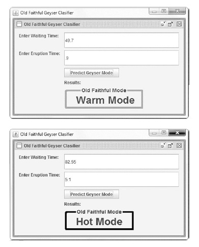

# Old-Faithful
This repository includes a the Old Faithful classification app for the Raspberry Pi. It is an Eclipse project which integrates a Weka library to handle the classification.

This project is covered in detail in chapter 6 of the [book](https://www.apress.com/us/book/9781484239506):

# About the Project
The goal for this project is to implement a GUI-based app for Raspberry Pi that integrates a pretrained ML model to make predictions.

Chapter 5 of the book covered the Old Faithful geyser dataset and saw how clustering helped to identify a hidden pattern in the data. 

The geyser has two “modes” which we will call “hot mode” and “warm mode.” Geologists probably have better terminology for this phenomenon. It makes sense that longer waiting times correlate to longer
eruption times. What is interesting is that are two distinct modes.

For this project, you will create an app for the Raspberry Pi that can inform us of the current geyser mode based on the waiting time and eruption time.

# Project References
Project Name: **Old Faithful**

Source: **old_faithful.zip** or **github.com/wickapps/Old-Faithful**

Type: **Eclipse Project targeted for the Raspberry Pi device**

# Requirements:
* Users will enter the values for the waiting time and the eruption time.
* Users will press a Predict button to get a prediction of the geyser
  mode.
* The app will run on the Raspberry Pi.
* The app will load a prebuilt model to handle the prediction.
* The app will include some basic GUI elements.

# Note: 
This project is an Eclipse Java project to build and export the **OldFaithful.jar** class, a classifier that can run on the Raspberry Pi device, or any Java client.

# File Description
| File                             | Description                                                  |
| -------------------------------- | ------------------------------------------------------------ |
| OldFaithful->src->OldFaithful.java | The main Java class. Contains everything including the GUI code. Loads the model and data file from the external Unix file system directory. |
| OldFaithful->libs->Weka-Android-3-8-1.jar | The Weka API library file. You can use the Android version for the Raspberry Pi. |
| /home/pi/Java-proj/Weka/old_faithful_rf_i10.model | RF model, external file |
| /home/pi/Java-proj/Weka/old_faithful_single_instance.arff | Single instance of data, external file |

# Application Screenshot

